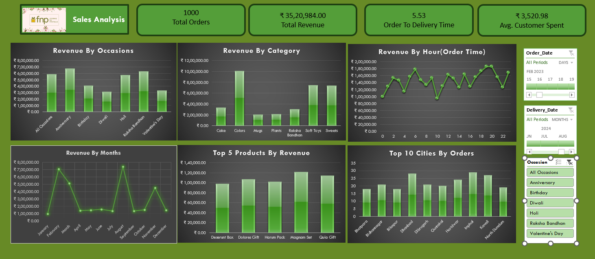

# Excel_FNP_Analysis

## Project Overview
This project presents a comprehensive Sales Analysis Dashboard for an e-commerce business specializing in occasion-based gifting. The dashboard provides insights into sales performance, customer behavior, and product popularity to support data-driven decision-making for optimizing sales strategies and enhancing the customer experience.

The dashboard is designed with an intuitive layout and includes interactive charts and Key Performance Indicators (KPIs) that allow stakeholders to monitor sales trends and identify key revenue drivers.

## Data Overview
The dashboard is built using three primary datasets:

1. **Customers Data**:
   - **Fields**: `Customer_ID`, `Name`, `City`, `Contact_Number`, `Email`, `Gender`, `Address`
   - **Description**: Contains information on customers including their demographic details (such as city, contact information, and address), helping to analyze customer distribution and behavior.

2. **Orders Data**:
   - **Fields**: `Order_ID`, `Customer_ID`, `Product_ID`, `Quantity`, `Order_Date`, `Order_Time`, `Delivery_Date`, `Delivery_Time`, `Location`, `Occasion`
   - **Description**: Includes details of individual orders such as the date and time of order and delivery, quantity, and occasion (e.g., Birthday, Diwali). This dataset enables analysis of order patterns, delivery timelines, and occasion-based demand.

3. **Products Data**:
   - **Fields**: `Product_ID`, `Product_Name`, `Category`, `Price (INR)`, `Occasion`
   - **Description**: Contains product information including category, price, and occasions for which products are typically purchased. This supports analysis of product performance and profitability across categories and occasions.

## Key Metrics and Insights
The dashboard tracks several essential metrics, including:

1. **Total Orders**: Displays the cumulative number of orders, providing a high-level view of order volume.
2. **Total Revenue**: Indicates the total revenue generated, offering an immediate understanding of overall sales performance.
3. **Order to Delivery Time**: Shows the average time taken from order placement to delivery, helping assess the efficiency of logistics operations.
4. **Average Customer Spend**: Represents the average amount spent per customer, valuable for tracking purchasing behavior.

## Visualizations and Analytics
The dashboard is segmented into multiple visualizations to explore different aspects of the sales data:

- **Revenue by Occasions**: Highlights revenue generated from various occasions, such as Anniversary, Birthday, Diwali, Holi, Raksha Bandhan, and Valentine's Day. This helps identify occasions that drive the most revenue, enabling targeted marketing.
- **Revenue by Category**: Shows revenue distribution across product categories (e.g., Cake, Colors, Mugs, Plants, Soft Toys, Sweets) to understand profitability by category and adjust product offerings.
- **Revenue by Hour (Order Time)**: Displays hourly revenue trends, helping identify peak order times for optimized staffing and promotions.
- **Revenue by Months**: Shows monthly revenue trends, helping detect seasonal patterns to inform inventory management and promotional strategies during peak months.
- **Top 5 Products by Revenue**: Lists the top five revenue-generating products, enabling focus on best-sellers and product development insights.
- **Top 10 Cities by Orders**: Identifies top cities by order volume, providing a geographic view of demand for regional marketing and logistics planning.

## Interactive Filters
To enhance data exploration, the dashboard includes interactive filters:

- **Order Date Filter**: Allows filtering by specific order dates, enabling period-specific analysis.
- **Delivery Date Filter**: Enables filtering by delivery dates, useful for tracking delivery times over different periods.
- **Occasion Filter**: Offers a selection of occasions to focus the analysis on particular events, valuable for occasion-based marketing.

## Business Benefits
This dashboard offers insights beneficial for various teams:

- **Marketing**: Identifies top-selling occasions, cities, and times to aid targeted marketing and seasonal campaign planning.
- **Operations**: Monitors order-to-delivery times to improve logistics processes.
- **Product Development**: Provides data on popular categories and products, guiding product innovation and inventory management.

## Key Findings
- **Correlation Between Order Quantity and Delivery Time**: The correlation coefficient between order quantity and delivery time was found to be 0.0035. This low correlation suggests that order quantity has minimal impact on delivery time, indicating that the logistics process remains efficient regardless of order volume.

# FNP Dataset for Sales and Customer Analysis

This repository contains a dataset used for analyzing sales and customer behavior in an occasion-based e-commerce business. The data focuses on various customer interactions, order details, and product information, which can be used to derive insights about sales performance, customer demographics, and product popularity.

## Dataset Overview

The FNP dataset includes the following files:

### 1. `customers.csv`
Contains information about the customers, including their demographic and contact information.

- **Columns**:
  - `Customer_ID`: Unique identifier for each customer.
  - `Name`: Customer's name.
  - `City`: City of residence.
  - `Contact_Number`: Customer's contact number.
  - `Email`: Customer's email address.
  - `Gender`: Gender of the customer.
  - `Address`: Full address of the customer.

### 2. `orders.csv`
Provides details of each order placed, including order timing, delivery information, and location.

- **Columns**:
  - `Order_ID`: Unique identifier for each order.
  - `Customer_ID`: ID linking each order to a customer.
  - `Product_ID`: ID of the ordered product.
  - `Quantity`: Quantity of items ordered.
  - `Order_Date`: Date when the order was placed.
  - `Order_Time`: Time when the order was placed.
  - `Delivery_Date`: Date of delivery.
  - `Delivery_Time`: Time of delivery.
  - `Location`: Location where the order was delivered.
  - `Occasion`: Occasion associated with the order, e.g., Birthday, Anniversary, Diwali.

### 3. `products.csv`
Contains information on the products available, their categories, and pricing.

- **Columns**:
  - `Product_ID`: Unique identifier for each product.
  - `Product_Name`: Name of the product.
  - `Category`: Product category (e.g., Cake, Plants, Mugs, Soft Toys).
  - `Price (INR)`: Price of the product in Indian Rupees.
  - `Occasion`: Occasion for which the product is typically purchased.

## Potential Use Cases

This dataset can support various analyses, such as:

1. **Customer Demographics**: Explore customer locations, average spending, and buying preferences.
2. **Sales Performance**: Track order volume, revenue, and trends across different occasions.
3. **Product Analysis**: Identify top-selling products, revenue drivers by category, and popular occasions.
4. **Logistics and Delivery**: Analyze average order-to-delivery times and geographic distribution of deliveries.

## Key Metrics and Insights

The data can help derive several key metrics and insights, including:

- **Total Orders**: Total number of orders placed.
- **Total Revenue**: Aggregate revenue generated.
- **Order-to-Delivery Time**: Average time from order placement to delivery.
- **Top Products**: Products generating the highest revenue.
- **Top Occasions by Revenue**: Occasions contributing the most to overall sales.

You can download the dataset here: [FNP_Dataset](FNP_Dataset)

